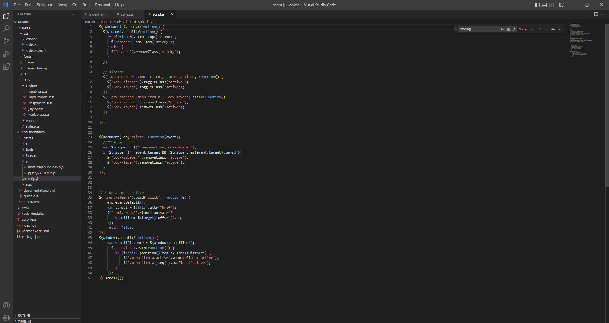

    Gokani Documentation            

*   [Getting Started](#start)
*   [installing](#installing)
*   [features](#features)
*   [Folder Structure](#folders)
*   [HTML Structure](#htmls)
*   [CSS Structure](#csss)
*   [JS Structure](#jss)
*   [source & credits](#credits)

*   [Preview](index.html)

#### Gokani CSS & HTML Portfolio Bootstrap 5 Template

##### Getting Started

Gokani is a fully responsive & developer friendly bootstrap 5 html template. it has different layout like a water layout, dark layout ,light layout, snow layout, gray scale layout. get Gokani template help & Create powerful & personal Portfolio website template for you. this template is comfortable with all devices & all browser like mobile, laptop, tablet , desktop , Mozilla Firefox , chrome , opera, safari.

You can use Gokani template for: agency, personal portfolio, architect agency, photography studios, sound and music, musician, painter portfolio, artworks, art, artist portfolio, web design works, illustrators, trainer, projects, freelance designer.

Gokani is built with CSS3, Bootstrap5, HTML5, JAVASCRIPT, jQuery, and SCSS Variable so developers can easily customize and develop templates. The most important thing is that it is 100% W3C Validated Template , structured code completely well commented code.

*   Created: 02/09/2022

#### installing

##### Install Node.Js

*   First, you download node.js and install.
*   you can download node js from [nodejs.org](https://nodejs.org/en/download/)
*   You can check node js version in your terminal using this commands node -v and npm -v

##### Install Gulp

Gulp is a cross-platform, streaming task runner that lets developers automate many development tasks. At a high level, gulp reads files as streams and pipes the streams to different tasks. These tasks are code-based and use plugins. The tasks modify the files, building source files into production files.[Gulp js](https://gulpjs.com/) is a toolkit that helps you automate time consuming tasks in your workflow.

*   First set the project path using you terminal
*   after set project path then use npm i command and install node modules.
*   gulp watchcommand (for run project).
*   use gulp watch command for run your project.

##### Dependencies For Gulp

*   gulp
*   gulp-sass
*   sass
*   gulp-autoprefixer
*   browser-sync

for about more details in gulp plugin use this link [https://gulpjs.com/plugins](https://gulpjs.com/plugins)

##### Set Live Reload Path

*   Set This Path in gulpfile.js
*   proxy: "http:/localhost/Project/...File-Path..."

#### Gokani features

*   Well Documentation
*   Single page layout
*   Cross Browser Compatible
*   Developer Friendly Coding
*   Bootstrap 5 grid system
*   Fully Customizable Layout
*   Creative and unique design
*   Light & Dark Mode
*   24/7 Support

#### Folder Structure

*   [Gokani](javascript:void(0);)
    *   [assets](javascript:void(0);)
        *   [css](javascript:void(0);)
        *   [fonts](javascript:void(0);)
        *   [images](javascript:void(0);)
        *   [js](javascript:void(0);)
        *   [scss](javascript:void(0);)
    *   [documentation](javascript:void(0);)
    *   [html](javascript:void(0);)

#### Html structure

#### css structure

#### js structure

#### Source & Credits

*   [Bootstrap](https://getbootstrap.com)
*   [freepik](https://www.freepik.com/)
*   [unsplash](https://unsplash.com/)
*   [flaticon](https://www.flaticon.com/)
*   [mixitup](https://www.kunkalabs.com/mixitup/)
*   [Slick Slider](https://kenwheeler.github.io/slick)
*   [Fancybox](https://fancyapps.com/docs/ui/fancybox/)
*   [Font Awesome Icon](https://fontawesome.com/v4/icons)